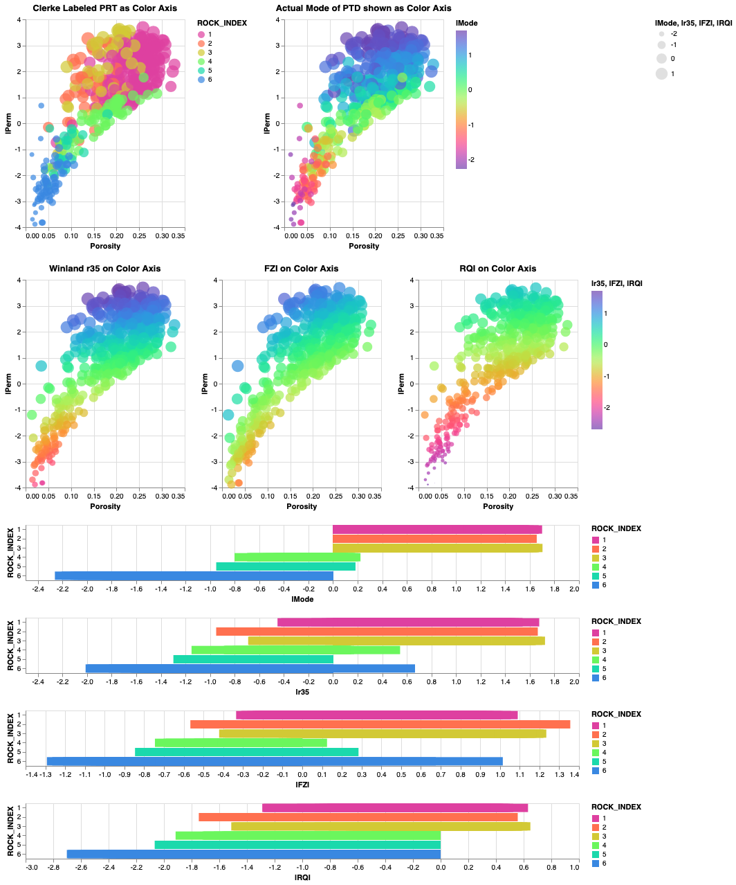

# Interrogate Petrophysical data using Python's Interactive Altair
The objective of this project is to interrogate Petrophysical core data using python's interacive Altair. 

### Data:

Clerke's Rosetta Stone Arab-D carbonate data(1) is used as the source data for our Pandas dataframe. Permeability (and log10 of perm lPerm) and Porosity are the routine core analysis data that we are using as a roadmap to interrogate our data. This is a very unique carbonate dataset in that Clerke masterfully randomly selected these data starting from 1,000's of inspected core plug samples that was were later culled down to the final samples in this set. This dataset covers the full range in poro-perm space for the Arab-D carbonate.  We also employ the Petrophysical Rock types (PRTs) developed by Clerke and compare this to Windland's r35 and Amaefule's FZI. 

1) Clerke, E. A., Mueller III, H. W., Phillips, E. C., Eyvazzadeh, R. Y., Jones, D. H., Ramamoorthy, R., Srivastava, A., (2008) “Application of Thomeer Hyperbolas to decode the pore systems, facies and reservoir properties of the Upper Jurassic Arab D Limestone, Ghawar field, Saudi Arabia: A Rosetta Stone approach”, GeoArabia, Vol. 13, No. 4, p. 113-160, October, 2008. 

### Thomeer Parameters and Petrophysical Rock Types:

G1, Pd1 and BV1 are the Thomeer parameters for the most dominant porosity system. G2, Pd2 and BV2 are the Thomeer parameters for the second porosity system. The following image relates the Thomeer parameters to the Capillary Pressure Curve. The Thomeer parameters were established by fitting the Thomeer hyperbola to the High Pressure Mercury Injection data. Most of the samples were fit in Ed Clerke's Thomeer spreadsheet that has been widely distributed. We also used Matlab to determine the Thomeer parameters using optimization. 

As observed from this dataset, most macro rock has a dual porosity system and on the Pore Throat Distribution you would have two modes; one mode has a Pore Throat radius > 2 microns. The second (or third) mode has a Pore Throat radius < 2 microns. As an example, the Petrophysical Rock Type (PRT) M_1 is a rock type as defined by Clerke. This is a macro rock with a second mode in the meso-porosity range where both pore systems can have oil saturations once the capillary pressure is great enough to drive out the water. A large portion of the Arab D has this M_1 PRT which has resulted in low water saturations and a unique pore system resulting in excellent oil recoveries. It just so happens that the meso-porous rock is preferentially water wet. When subject to a water flood, this rock spontaneously imbibes the water and expels to oil resulting in exceptional recoveries. The M_2 PRT is also a macro rock, but the second pore system is micro-porous and is too tight to have hydrocarbon saturations. 

The Table below shows Clerke's description of his PRT's:  

The following are some example plot results where the plots are all interactive using Altair:

We are using Conda on a mac and Altair works fairly well in a jupyter notebook. To run as pure python program altair_viewer must also be used to render the images to a html web page. We are low on the learning curve with Altair finding new capabilities each day. Consider this repository an example of where we are today. 

